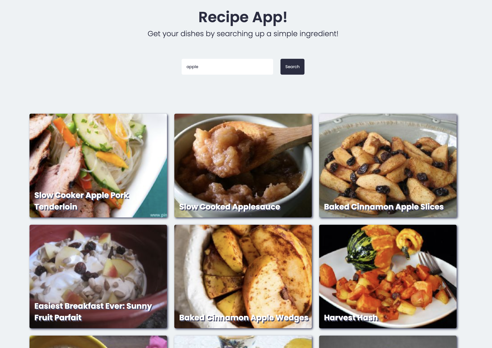
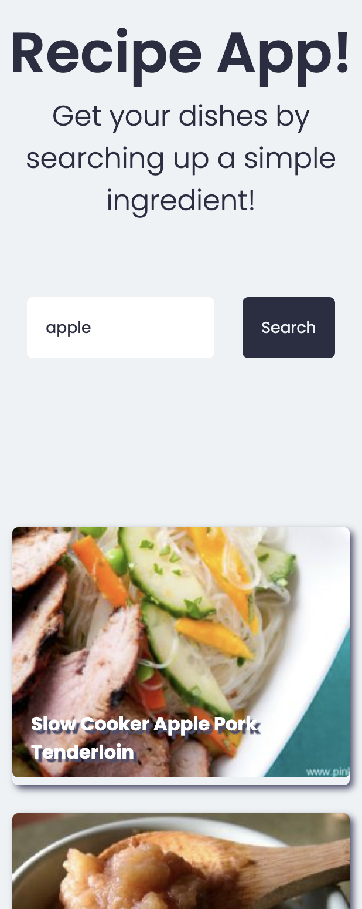

# ToDo-List 

## First introduction to Javascript.

### Desktop

### Phone

- I learned how to use a basic REST API to create an application that will populate the page with recipes when ingredients are input into the search bar. Also, learning how to use an async function in javascript.

# Features

- [x] REST API 
- [x] Async functions 
- [x] Responsive
- [x] Alert if input is not filled
